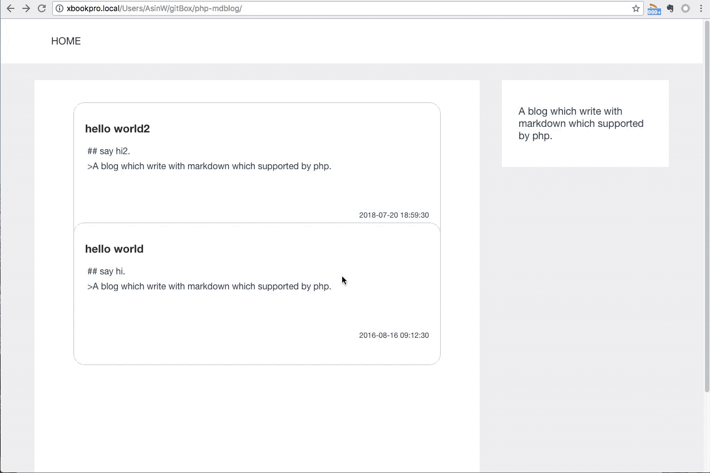

# php-mdblog
A blog which write with markdown which supported by php.

[demo](http://appjk.com/blog)

## 支持特性
* 免数据库，免安装，直接存储到任意 PHP 环境目录中即可访问。
* 使用 Markdown 语法，以文件夹形式存储，图片紧随不丢不乱。
* 不用编译，保存文档就是发布。
* 支持标签
* 支持编辑时间，默认按编辑时间排序。（2018年07月27日17:40:18新增）
* 支持站点地图，支持 rss

## 缺点（不会支持）
* 不支持留言
* 不支持在线编辑
* 没有用户系统

## 运行环境

* 默认使用 `Apache+PHP` 的运行环境，使用 `.htaccess` 进行网址转换。
* 如果使用 `Nginx` 或其他环境，需要重写网址到 `index.php` 进行处理。

## 如何安装

* 将整个项目下载并放置到网站所在文件夹中即可。
    * 如：将`php-mdblog`放置到 `webroot/` 目录下，其中 `webroot` 为网站根目录，则访问 `example.com/php-mdblog` 即可。

## 如何使用

* 在 `./post/` 目录下使用时间戳或时间格式的文本创建一个文件夹，如 `20160816091230`
    - 也可以使用`创建时间.修改时间.标签1.标签2`的方式创建带标签的文件夹
    - 时间戳也可以换成`2018-07-25 10:24:13`这样的日期格式
    - 时间戳也可以换成`2018年07月25日10:24:29`这样的日期格式
    - 注意，创建时间的文字和格式尽量不要改动，因为最终的页面是以创建时间的文字作为 url 链接的。
* 在文件夹中创建 `标题.md` 的文件，如 `hello world.md`
* 在这个 `.md` 文件中编写文章，建议使用 Markdown 语法，也可用原生 HTML 语法。
* 使用 FTP 工具上传到网站服务器中，
* 即可在 `example.com/php-mdblog` 中看到新出现的文章啦。

## 第三方库
[parsedown](https://github.com/erusev/parsedown) | [highlight.js](https://github.com/highlightjs/highlight.js) | [github-markdown-css](https://github.com/sindresorhus/github-markdown-css)

